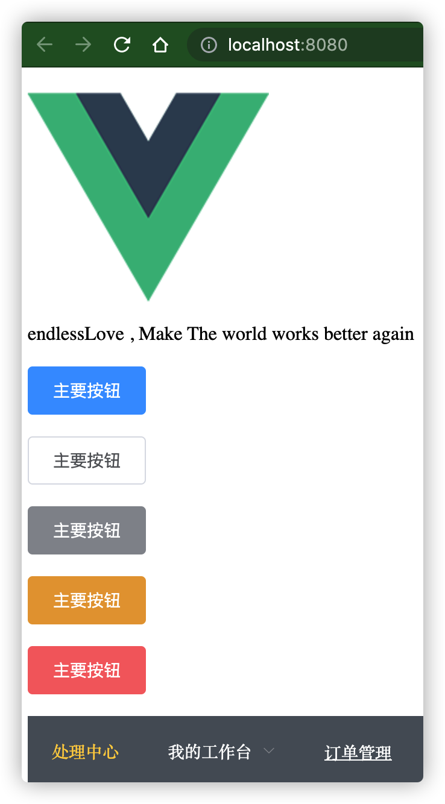

# vue-player


##  参考资料
https://blog.csdn.net/Sakura__Lu/article/details/115610374   
https://segmentfault.com/a/1190000013219163
https://www.jianshu.com/p/f5bbcbd5b4b5





## Project setup
```
yarn install
```

### Compiles and hot-reloads for development
```
yarn serve
```

### Compiles and minifies for production
```
yarn build
```

### Lints and fixes files
```
yarn lint
```

### Customize configuration
See [Configuration Reference](https://cli.vuejs.org/config/).
